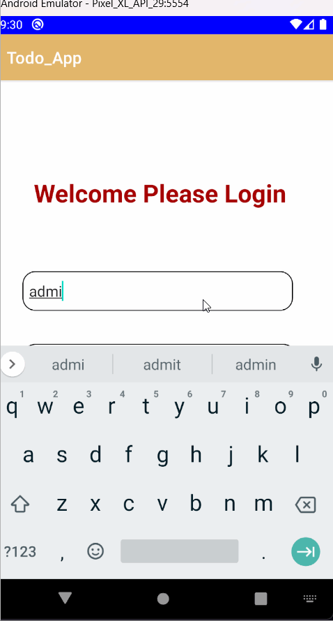
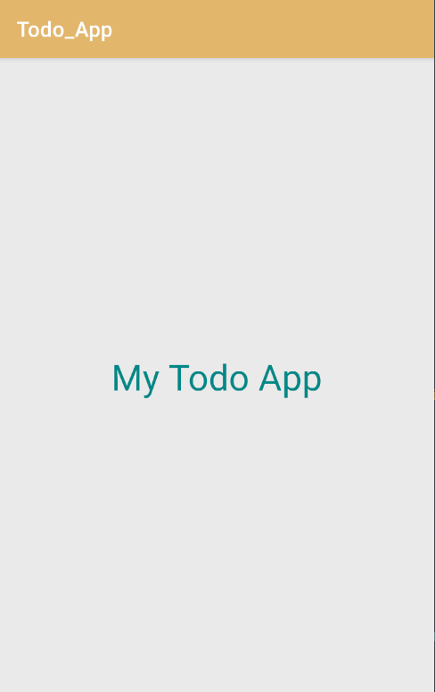
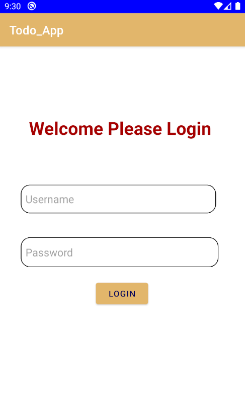
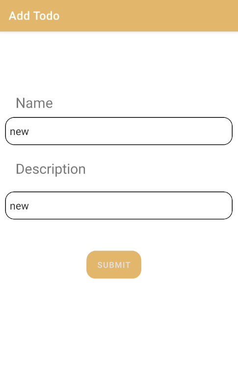
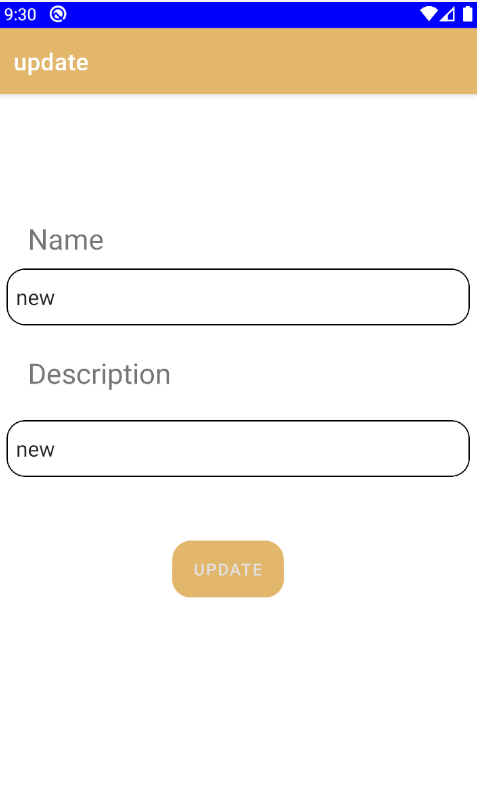

TODO

The above gif is the complete demo of the Todo App

<h3>Splash Screen</h3>
<h3>Login In</h3>
<h3>Add Task</h3>
<h3>Update Task</h3>

<h3>Basic Features</h3>

Add Task

Delete Task

Update Task

<h3>Additional Features</h3>

Login and logout

Swipe to delete and update the task

Use of Room Database to store data

